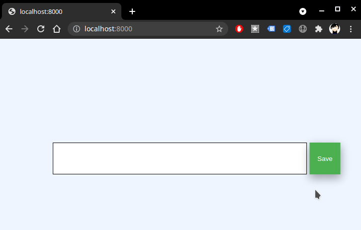

# Magnet downloader

## Server
There is a small application where one can paste magnet urls.
To start the server run:

```
./bin/download.sh -vvv cmd-listen
```

Then you will be able to nativate to: [http://localhost:8000/](http://localhost:8000/)




when pasting and saving an url, a new entry is created under:
`bin/listener/cgi-bin/requests/`

### todo
there should be a command that checks the directory  `bin/listener/cgi-bin/requests/` and downloads the magnets.

### series downloader
alternativellly one can upload the content to the directories `var/series` each subdirectory is a `serie` which can contain either a torrent in the directory `var/series/{serie}/torrent` or a magnet in `var/series/{serie}/magnet`.

When a torrent or a magnet is present, the download process can be started:
```bash
./bin/download.sh -vv cmd-download
```
